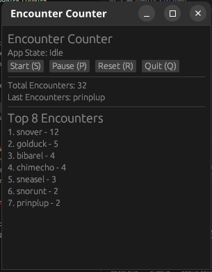

# Lineuz Encounter Counter v0.1.1

## Description
Encounter counter for the Pokemmo, Windows - Linux - MacOS (only Linux and Windows are tested)
It is a simple tool to keep track of the number of encounters in the game.

#### App Preview
<p align="left">
  
</p>

## Features
- Automaticaly count the number of encounters after clicking Start.
- Can be paused in case you don't want to count irrelevant to them (when you do something else in game mid-shunt)
- The current shunt is auto saved and will be loaded upon new activation of the app.
- Can be resetted for new shunt.
- Does not rely on font type, so even if you have in-game font type modified (i.e. due to Archetype), the counter still works.
- Does not have to be set up in mods folder/dir in PokeMMO folder/dir, you can run the app straight.

## How to use
- When app is first opened, you need to click Start for it to start counting.
- During the count, you can press Pause to pause the counter
- It's best if you click Pause before Resetting or Quitting, although I haven't seen any issue with clicking them straight.

> [!IMPORTANT]
Highly recommended to play PokeMMO that occupies at least 60% of your PC/Laptop screen's width and full height.

## Installation
### Using stand alone app
If you don't want to to install Rust, follow this link below for stand alone app download
[**here**](https://github.com/neuzzz3628/lineuz_encounter_counter/releases)

| System | What to do |
| ---| --- |
|**Windows**| **1.** Just run .exe |
|**Linux**| **1.** Open terminal <br> **2.** Go to the directory of app <br> **3.** Run the following command <br> <pre><code>./lineuz_counter|
|**Mac**| **1.** If your mac is from before 2020 (intel chip), choose macos-latest-x64.zip, if your mac is from after 2020 (m1/m2/3 chip) choose macos-latest-arm64.zip <br> **2.** Double click on the app, hit s <br> **3.** Mac will ask you to give terminal permissions to take screenshots, hit ok <br> **4.** Close terminal and run app again ||

### Run from source
| System | Initial Setup |
| ---| --- |
|**Windows**| Install Visual Studio 2022 with C++ build tools https://visualstudio.microsoft.com/downloads/ |
|**Linux**| Install dependencies Ubuntu / Mint / Debian / PopOS <br> <pre><code>sudo apt-get install build-essential libxcb-shm0-dev libxcb-randr0-dev xcb git libxcb1 libxrandr2 libdbus-1-3|
|**Mac**| Install Xcode from the App Store |


#### All platforms
1. Clone the repository (using SSH)
2. Install Rust language from [here](https://www.rust-lang.org/tools/install) 
3. Run the following command in the terminal
```bash
git clone github.com/neuzzz3628/lineuz_encounter_counter
cd lineuz_counter
cargo run --release
```

## Todo List
- [x] Replace TUI with GUI
- [x] GUI operates normally
- [ ] Fix issues where it misread name and accept them to the counter
- [ ] Fix button clicks that are a bit slow in responsiveness
- [ ] Add most recent encounters
- [ ] Modify top 8 to include % encounter per total
- [ ] Grid-based
- [ ] Add sprites, replacing name to make GUI looks cooler
- [ ] Add app logo
- [ ] Add more profiles for different shunt switches
- [ ] Allow theme customization


<div style="padding: 15px; border-left: 5px solid rgb(6, 240, 248); border-radius: 3px; margin: 15px 0;">
<strong>Known Issues </strong> <br>
- Sometimes a wild encounter is not recognized, hence no count. Tend to happen if you alt-tab mid-encounter animation. Fail rate < 8%. <br>
- GUI still works even if minimized, however the GUI only updates when you un-minimize it. <br>
- [Half-screen play only ]Clicking on chat box will make top left corner's text (incl. active charms) to overlay on top of Pokemon names, blocking the detection of those blocked Pokemon.
</div>

## Todo in da future?
- [ ] Add modes for egg shunting and fossil shunting (manual adding)
- [ ] Multiple languages support? (need help from feedback)
- [ ] Develop a mobile app counter
- [ ] Allow save state to be transferable between different devices (PC, mobiles)

## Disclaimer
This software has been created from the my anger of not having a proper Linux encounter counter. It is not intended to be used to attack other systems, nor does it provide the user any unfair advantage. It does not hook or inject into any game processes. There are no artificial inputs or hotkeys simulated. Project maintainers are not responsible or liable for misuse of the software. Source code can be viewed in github. Use responsibly.

